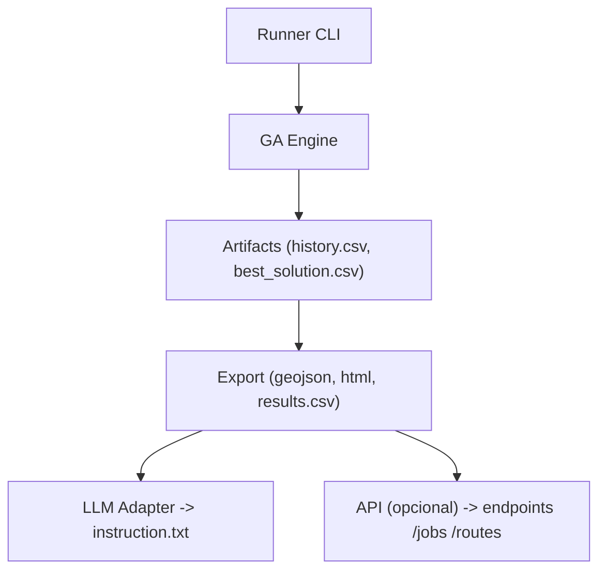

# Tech Challenge — Fase 2 (Foco: Projeto 2 — Otimização de Rotas Médicas)

Este repositório documenta a proposta e as orientações para implementar o Projeto 2: otimização de rotas para distribuição de medicamentos e insumos em contexto hospitalar, usando Algoritmos Genéticos (AG) e integração com LLMs para geração de instruções e relatórios.

## Visão geral

O objetivo é desenvolver um sistema de otimização de rotas (TSP/VRP) adaptado às restrições de um ambiente hospitalar: prioridades de entregas, capacidade dos veículos, autonomia, múltiplos veículos e janelas de tempo, quando aplicável. A solução deve oferecer visualização das rotas e geração de instruções/relatórios em linguagem natural via LLM.

## Objetivos específicos (Projeto 2)

- Implementar representação genética adequada para rotas (codificação de caminhos).
- Projetar operadores genéticos especializados (seleção, crossover, mutação) para TSP/VRP.
- Criar função fitness que considere distância, prioridade das entregas, capacidade de carga e autonomia dos veículos.
- Incluir restrições realistas: prioridades, capacidades, autonomia, múltiplos veículos (VRP).
- Visualizar rotas otimizadas em mapa (HTML/JS) e exportar resultados (CSV/GeoJSON).
- Integrar LLM para gerar instruções detalhadas e relatórios de eficiência.
- Realizar ao menos 3 experimentos variando parâmetros do AG e documentar comparativos.

## Requisitos técnicos (detalhado)

1. Partir do código-base de TSP fornecido e adaptá-lo para o contexto hospitalar.
2. Implementar operadores genéticos apropriados para sequências de rota (e.g., order crossover, swap mutation).
3. Definir e justificar a função fitness (peso entre distância, prioridade, capacidade, tempo).
4. Adicionar logging/monitoramento para experimento (salvar histórico de fitness por geração).
5. Gerar visualizações: mapa interativo (folium/kepler.gl) e gráfico de convergência.
6. Implementar endpoints mínimos (se optar por API): otimização, status de job, recuperação de rotas.
7. Documentar arquitetura, decisões, limitações e resultados no relatório técnico.

## Entregáveis (Projeto 2)

- Código-fonte modificado a partir do TSP base.
- Notebooks/scripts de demonstração (ex.: executar experimento e gerar mapa).
- Pasta `experiments/` com resultados (CSV), plots e HTMLs das rotas.
- Relatório técnico (metodologia, configurações, métricas e comparativos).
- Vídeo de demonstração (até 15 minutos) mostrando: execução, visualização de rotas e exemplo de instrução gerada pela LLM.

## Instalação e execução (exemplos focados em Projeto 2)

Recomenda-se Python 3.10+. Exemplos abaixo via venv e Poetry.

Usando venv:

```bash
python3 -m venv .venv
source .venv/bin/activate
pip install -r requirements.txt
# exemplo: rodar experimento de otimização
python -m src.optimize --config experiments/configs/experiment_01.yaml
```

Exemplo de `requirements.txt` mínimo (sugestão):

```text
numpy
pandas
networkx
folium
geopandas
shapely
matplotlib
pytest
requests
openai  # se usar OpenAI para LLM
```

Usando Poetry:

```bash
poetry install
poetry run python -m src.optimize --config experiments/configs/experiment_01.yaml
```

Exemplo simples (rodando o TSP base):

```bash
python src/tsp/run_tsp.py --input data/instances/hospital_points.csv --output experiments/run_001/
# gera arquivos: routes.geojson, results.csv, route_map.html
```

Com Docker (opcional):

```bash
docker build -t tech-challenge-routes:latest .
docker run --rm -v $(pwd)/experiments:/app/experiments tech-challenge-routes:latest \
  python -m src.optimize --config experiments/configs/experiment_01.yaml
```

## Instalação offline (wheelhouse)

Se você estiver em um ambiente sem acesso à internet, use um wheelhouse (coleção de wheels) criado em outra máquina com conectividade:

1. Em uma máquina com internet, gere as wheels:

```bash
./scripts/build_wheelhouse.sh python3.10 wheelhouse
```

2. Transfira o diretório `wheelhouse/` para a máquina offline (via pendrive, scp, etc.).

3. Na máquina offline, instale a partir do wheelhouse:

```bash
./scripts/install_from_wheelhouse.sh wheelhouse .venv
```

Observações:

- Pacotes geoespaciais (GDAL, geopandas, etc.) podem exigir bibliotecas de sistema na máquina alvo (ex.: libgdal). Instale-as antes de instalar os wheels.
- Os scripts em `scripts/` são fornecidos para conveniência; torne-os executáveis com `chmod +x scripts/*.sh` antes de usar.

## Dependências de sistema (Ubuntu / macOS / Windows)

Algumas bibliotecas Python geoespaciais (GDAL, geopandas, fiona, shapely) dependem de bibliotecas nativas. Abaixo estão comandos recomendados para preparar ambientes em diferentes sistemas.

Ubuntu / Debian (apt):

```bash
sudo apt-get update
sudo apt-get install -y build-essential python3-dev python3-venv \
  gdal-bin libgdal-dev libpq-dev
# opcionalmente instalar ferramentas auxiliares
sudo apt-get install -y libgeos-dev libproj-dev
```

macOS (Homebrew):

```bash
# instale Homebrew se não tiver: https://brew.sh
brew update
brew install gdal proj geos
```

Nota importante (macOS):

- Antes de instalar pacotes via Homebrew, certifique-se de que o Xcode Command Line Tools esteja instalado:

```bash
xcode-select --install
```

- Em máquinas macOS com Apple Silicon (M1/M2), verifique se o Homebrew está instalado em `/opt/homebrew` e prefira usar pacotes do canal `conda-forge` quando enfrentar problemas binários.

### Checklist pré-execução (macOS)

Antes de instalar dependências ou rodar os scripts, verifique:

- Xcode Command Line Tools instalados:

```bash
xcode-select --install
```

- Homebrew disponível e no PATH:

```bash
brew --version
```

- Python 3.10+ disponível (ou uso de `poetry`/`conda`):

```bash
python3 --version
```

- Se Apple Silicon (M1/M2): confirme Homebrew em `/opt/homebrew` ou prefira `conda-forge`.

- Reinicie o terminal após instalar Homebrew ou alterar PATH.

### Checklist pré-execução (Ubuntu)

Antes de instalar dependências ou rodar os scripts, verifique:

- Atualize índices e tenha apt funcional:

```bash
sudo apt-get update
```

- Verifique Python 3.10+:

```bash
python3 --version
```

- Verifique ferramentas de build presentes (ex.: build-essential):

```bash
dpkg -s build-essential || echo "instale build-essential"
```

- Se usar Docker, confirme daemon ativo:

```bash
docker info
```

### Checklist pré-execução (Windows)

Antes de instalar dependências ou rodar os scripts, verifique:

- Recomenda-se usar Conda/Miniconda:

```powershell
conda --version
```

- Verifique Python (se não usar conda):

```powershell
python --version
```

- Para Docker, confirme Docker Desktop rodando (Windows) e WSL2 habilitado para melhor compatibilidade:
  - Abra Docker Desktop e confirme status "Running".

- Se instalar ferramentas nativas (GDAL), prefira canais conda-forge para evitar problemas binários:

```powershell
conda install -c conda-forge gdal geopandas -y
```

### Links úteis

- Homebrew: https://brew.sh
- Conda / Miniconda: https://docs.conda.io/en/latest/
- Conda-forge: https://conda-forge.org/
- Docker Desktop: https://www.docker.com/products/docker-desktop
- OSGeo4W (Windows GDAL/OSGeo): https://trac.osgeo.org/osgeo4w/
- PyPI (pacotes Python): https://pypi.org/

Windows (recomendado: Conda / Miniconda)

Opção mais simples — usar conda (recomendado para pacotes geoespaciais):

```bash
# criar ambiente
conda create -n tech-challenge python=3.10 -y
conda activate tech-challenge
conda install -c conda-forge gdal geopandas fiona shapely pyproj -y
```

Se preferir usar pip no Windows, instale previamente GDAL/OSGeo via OSGeo4W ou instale wheels binários apropriados — o método mais confiável é conda/conda-forge.

Notas:

- Em ambientes Apple Silicon (M1/M2) pode ser necessário usar versões compatíveis do Homebrew (em /opt/homebrew) e instalar dependências via conda-forge para evitar problemas binários.
- Após instalar bibliotecas de sistema, use `pip install -r requirements.txt` ou instale a partir do wheelhouse.

## Estrutura sugerida do repositório (foco Projeto 2)

```
.
├─ README.md
├─ requirements.txt / pyproject.toml
├─ Dockerfile
├─ data/                   # instâncias, pontos de entrega, malhas viárias (opcional)
├─ notebooks/              # notebooks de experimento / demonstração
├─ src/
│  ├─ tsp/                 # código-base TSP fornecido (adaptado)
│  ├─ ga/                  # implementação do Algoritmo Genético para roteamento
│  ├─ viz/                 # geração de mapas (folium) e plots
│  ├─ api/                 # API (FastAPI/Flask) se aplicável
│  └─ optimize.py          # runner para experimentos
├─ experiments/
│  ├─ configs/             # arquivos de configuração dos experimentos (yaml)
│  ├─ run_001/             # resultados de um experimento (csv, plots, html)
├─ tests/
└─ docs/
```

## Tecnologias e bibliotecas recomendadas

- Python 3.10+
- Algoritmos genéticos: implementação própria ou libs auxiliares (de preferência customizada para controle dos operadores).
- Grafos/roteamento: `networkx`, `ortools` (opcional para baseline).
- Geoprocessamento/visualização: `geopandas`, `shapely`, `folium`, `kepler.gl` (opcional).
- Experimentos: `pandas`, `matplotlib`, `seaborn`.
- LLMs: `openai` (ou integração com modelo local).
- API (opcional): `FastAPI` + `uvicorn`.

## Endpoints sugeridos (API)

- POST /optimize
  - Inicia job de otimização. Parâmetros: instancia, população, mutação, geracoes, constraints.
  - Retorna: job_id.
- GET /jobs/{job_id}
  - Retorna status, métricas parciais e link para artefatos.
- GET /routes/{job_id}
  - Retorna geojson das rotas, CSV com ordenação de entregas e HTML do mapa.
- POST /instructions/{route_id}
  - Gera instruções detalhadas para motorista/equipe usando LLM.

## Métricas e experimentos

Avalie especialmente:

- Distância total percorrida.
- Tempo estimado (se disponível).
- Número de veículos utilizados.
- Cumprimento de prioridades (penalidades aplicadas na fitness).
- Carga utilizada vs capacidade.

Organize resultados por experimento em `experiments/{run_id}/results.csv` e inclua `plots/convergence.png` e `route_map.html`.

## Visualização das rotas

- Gere mapas interativos (folium) e exporte como `route_map.html`.
- Para análise, exporte `routes.geojson` com propriedades (vehicle_id, sequence, load, priority).

Exemplo rápido (folium):

```python
import folium
m = folium.Map(location=[-23.55, -46.63], zoom_start=12)
folium.PolyLine([(lat1, lon1), (lat2, lon2), ...]).add_to(m)
m.save('route_map.html')
```

## Testes e CI

- Escreva testes unitários para operadores genéticos, função fitness e parsers de instância.
- Exemplo de comando:

```bash
pytest -q
```

- Sugestão de CI: GitHub Actions que execute lint (flake8/ruff), testes e workflow de experimentos (opcional).

## Deploy / Infraestrutura como Código (opcional)

- Se usar nuvem, documente: como executar jobs em batch, armazenamento de artefatos e endpoints.
- Exemplos: containerizar runner e usar AWS Batch / ECS, ou deploy de API com Fargate.

## Licença

Por padrão: MIT License. Substitua se for necessário outra licença.

```
MIT License
```

## Como contribuir

- Abra issues detalhando bugs/funcionalidades.
- Pull requests pequenos com testes e descrição.
- Siga PEP8/PEP257; inclua testes para novas funções.

## Recursos internos (atual)

Arquivos e módulos relevantes já presentes neste repositório:

- Código GA e utilitários: `src/ga/representation.py`, `src/ga/fitness.py`, `src/ga/operators.py`, `src/ga/population.py`  
- Runner e exemplos: `src/optimize.py`, `scripts/run_local.sh`  
- Scripts auxiliares: `scripts/build_wheelhouse.sh`, `scripts/install_from_wheelhouse.sh`, `scripts/install_system_deps.sh`, `scripts/validate_parse.py`, `scripts/validate_repr.py`  
- Experimentos e dados: `experiments/configs/experiment_01.yaml`, `experiments/prompts/route_instructions_prompt.txt`, `data/instances/hospital_points.csv`  
- Documentação adicional: `docs/design_repr.md`, `docs/implementation_notes.md`, `docs/fitness.md`  
- Testes: `tests/ga/` (ex.: `test_repr.py`, `test_fitness.py`, `test_fitness_penalties.py`)  
- CI: `.github/workflows/ci.yml`

## Como rodar testes e validações rápidas

Recomenda-se usar PYTHONPATH para rodar os scripts e testes locais:

```bash
# Rodar todos os testes
PYTHONPATH=. pytest -q

# Rodar validação do parser/representação
PYTHONPATH=. python3 scripts/validate_parse.py
PYTHONPATH=. python3 scripts/validate_repr.py
```

Os artefatos de validação são gravados em `experiments/validate_parse.json` e `experiments/validate_repr.json`.

## Convenções de branching e commits

- Branch por feature: `feat/vrp-<short>` (ex.: `feat/vrp-fitness`).  
- Mensagens de commit: `type(scope): short description` (ex.: `feat(vrp): add fitness penalties`).  
- Fluxo sugerido por etapa: Implement → Test → Commit → Document → Push → PR. Inclua no corpo do commit um breve resumo das validações e caminhos para artefatos.

## Links rápidos para docs

- Design da representação: `docs/design_repr.md`  
- Notas de implementação (parser & stubs): `docs/implementation_notes.md`  
- Fitness (métricas e penalidades): `docs/fitness.md`
 
## Status atual do projeto

Implementações já concluídas (resumo):

- Representação VRP e parser CSV (`src/ga/representation.py`)  
- Núcleo de fitness com Haversine e penalidades por capacidade/prioridade (`src/ga/fitness.py`)  
- Operadores genéticos: relocate, swap, 2-opt e crossover VRP (`src/ga/operators.py`)  
- Inicializadores heurísticos: nearest neighbor e Clarke-Wright (`src/ga/initialization.py`)  
- População e selection (tournament, roulette) (`src/ga/population.py`)  
- Engine GA e runner de exemplo (`src/ga/engine.py`, `scripts/run_ga_example.py`)  
- Export e visualização: GeoJSON e mapa HTML (`src/viz/map.py`, `scripts/export_artifacts.py`)  
- Integração LLM (adapter OpenAI + fallback) e geração de instruções (`src/llm/adapter.py`, `scripts/generate_instructions.py`)  
- Scripts utilitários e de suporte: `scripts/run_local.sh`, `scripts/build_wheelhouse.sh`, `scripts/install_from_wheelhouse.sh`, `scripts/install_system_deps.sh`  
- Testes básicos e documentação inicial nos arquivos `docs/` e `tests/ga/`.

## Quickstart

1. Instale dependências (venv ou Poetry). Recomenda-se Poetry:

```bash
poetry install
poetry shell
```

Ou com venv/pip:

```bash
python3 -m venv .venv
source .venv/bin/activate
pip install -r requirements.txt
```

2. Rodar validações rápidas:

```bash
PYTHONPATH=. python3 scripts/validate_parse.py
PYTHONPATH=. python3 scripts/validate_repr.py
```

3. Rodar um experimento de exemplo (GA curto):

```bash
PYTHONPATH=. python3 scripts/run_ga_example.py
```

4. Exportar artefatos (geojson, html, results.csv) a partir do diretório do run:

```bash
PYTHONPATH=. python3 scripts/export_artifacts.py experiments/run_<timestamp>
```

5. Gerar instruções com LLM (fallback se sem chave):

```bash
PYTHONPATH=. python3 scripts/generate_instructions.py experiments/run_<timestamp>
```

## Artefatos gerados

Os runs geram um diretório `experiments/run_<timestamp>/` contendo:

- `history.csv` — histórico por geração (generation, best_fitness, avg_fitness)  
- `best_solution.csv` — rotas do melhor indivíduo (route_index, sequence com '|' como separador)  
- `routes.geojson` — GeoJSON com LineString por veículo e propriedades (vehicle_id, sequence, load, priorities)  
- `route_map.html` — mapa interativo (folium)  
- `results.csv` — resumo (total_distance, total_load, vehicles)

Consulte `docs/output_formats.md` para mais detalhes.

## Arquitetura / Fluxo



## CI e testes

Rodar testes locais:

```bash
PYTHONPATH=. pytest -q
```

Workflow CI inicial está em `.github/workflows/ci.yml` (executa testes e sobe artefatos de experimentos).
